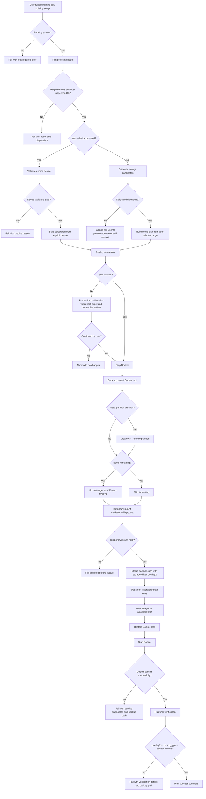

# GPU Splitting Setup Plan

## Goal

Implement a one-command host preparation flow for LIUM GPU splitting:

```bash
sudo lium mine gpu-splitting setup [--device /dev/...] [--yes]
```

The command must:

- prepare Docker storage for LIUM GPU splitting
- migrate Docker data to an `xfs` backing filesystem
- enforce Docker `overlay2`
- mount Docker root with `pquota`
- verify the resulting configuration
- be safe by default

The design must also support:

- explicit human-supplied device selection via `--device`
- safe auto-selection when `--device` is omitted
- read-only helper commands for inspection and verification

This plan is for a coding agent implementing the feature in this repository.

## Product Direction

Use one primary command for the full setup path, plus read-only subcommands:

```bash
sudo lium mine gpu-splitting setup [--device /dev/nvme1n1] [--yes]
lium mine gpu-splitting check [--device /dev/nvme1n1]
lium mine gpu-splitting verify
```

Behavior expectations:

- `setup` performs the full end-to-end migration.
- `check` is read-only and prints what `setup` would do.
- `verify` is read-only and confirms the machine matches LIUM requirements.

Do not require users to run multiple commands for the normal path. `check` and `verify` are optional diagnostics only.

## CLI Shape

Refactor the existing `mine` command into a Click group.

Recommended structure:

- `lium mine executor-setup ...`
- `lium mine gpu-splitting setup ...`
- `lium mine gpu-splitting check ...`
- `lium mine gpu-splitting verify`

If preserving the current `lium mine` behavior is important, expose the current logic as:

- `lium mine executor setup ...`

But avoid combining unrelated executor bootstrap logic with host filesystem migration logic.

## Files To Touch

Expected files:

- `/home/pyon/projects/lium/lium/cli/commands/mine.py`
- `/home/pyon/projects/lium/lium/cli/cli.py`

Likely new files:

- `/home/pyon/projects/lium/lium/cli/mine/__init__.py`
- `/home/pyon/projects/lium/lium/cli/mine/group.py`
- `/home/pyon/projects/lium/lium/cli/mine/executor_setup.py`
- `/home/pyon/projects/lium/lium/cli/mine/gpu_splitting.py`
- `/home/pyon/projects/lium/lium/cli/mine/storage.py`
- `/home/pyon/projects/lium/lium/cli/mine/docker_config.py`
- `/home/pyon/projects/lium/lium/cli/mine/models.py`

Suggested responsibilities for the new `lium/cli/mine` package:

- `__init__.py`: package entrypoint that re-exports the top-level `mine` Click group for CLI registration.
- `group.py`: defines the `lium mine` Click group and wires subcommands such as executor setup and GPU splitting.
- `executor_setup.py`: contains the current executor bootstrap flow moved out of the legacy single-command `mine` implementation.
- `gpu_splitting.py`: implements the user-facing `gpu-splitting setup`, `check`, and `verify` commands, including plan display and confirmations.
- `storage.py`: handles block-device inspection, storage target classification, explicit `--device` validation, and safe auto-selection.
- `docker_config.py`: manages Docker-specific inspection and configuration updates, including `docker info`, `daemon.json`, and related verification helpers.
- `models.py`: defines the typed internal models shared across the GPU splitting implementation, such as device, mount, Docker state, plan, and verification result objects.

Tests:

- `/home/pyon/projects/lium/test/test_gpu_splitting_storage.py`
- `/home/pyon/projects/lium/test/test_gpu_splitting_cli.py`

The implementation should separate:

- CLI parsing
- storage inspection / candidate selection
- destructive system actions
- verification logic

## Scope

### In scope

- inspect block devices and current Docker state
- validate explicit `--device`
- auto-select a safe target when `--device` is omitted
- create GPT and partition when needed
- format target as `xfs` with `ftype=1`
- back up Docker data
- stop Docker
- mount target with `pquota`
- merge `/etc/docker/daemon.json` to enforce `overlay2`
- update `/etc/fstab` using UUID
- restore Docker data
- restart Docker
- verify final Docker storage state

### Out of scope

- shrinking existing mounted partitions
- resizing root filesystems
- automatic recovery from arbitrary operator mistakes outside the command
- managing multiple Docker data roots
- supporting non-Linux systems

## Hard Safety Rules

The command must refuse to proceed if:

- the target device or partition is the current root filesystem
- the only way forward is shrinking an existing partition
- the explicit `--device` is mounted in use in a conflicting way
- the explicit `--device` already contains a filesystem and no force flag exists
- the target appears to contain live user data
- `/etc/docker/daemon.json` is invalid JSON and cannot be parsed safely
- Docker root is not writable after mount
- verification after setup fails

The command must never:

- run `mkfs` on the root disk partition
- auto-shrink partitions
- replace `/etc/docker/daemon.json` blindly
- append duplicate `/etc/fstab` entries indefinitely

## Destructive Confirmation Policy

This must be explicit in the CLI behavior.

Any destructive operation requires a human confirmation step unless `--yes` is passed.

Destructive operations include:

- creating a new GPT label on a disk
- creating a new partition
- formatting a partition with `mkfs.xfs`
- modifying `/etc/fstab`
- modifying `/etc/docker/daemon.json`
- stopping Docker as part of the migration
- mounting the new partition onto `/var/lib/docker`

At minimum, `setup` must display a confirmation prompt after target resolution and before the first destructive action.

The confirmation output must include:

- whether the target came from explicit `--device` or auto-selection
- the exact target path that will be changed
- whether the operation will create a partition
- whether the operation will format the partition
- whether existing Docker data will be migrated
- the backup directory that will be created

Example intent of the confirmation:

```text
Selected target: /dev/nvme1n1
Selection mode: auto
Planned changes:
- create GPT label on /dev/nvme1n1
- create partition /dev/nvme1n1p1
- format /dev/nvme1n1p1 as XFS
- stop Docker
- migrate /var/lib/docker
- update /etc/docker/daemon.json
- update /etc/fstab

Proceed? [y/N]
```

If `--yes` is provided, the CLI may skip the interactive prompt, but it must still print the exact destructive plan before executing it.

## Device Input Model

The command takes an optional `--device`.

Accepted forms:

- whole disk, e.g. `/dev/nvme1n1`
- partition, e.g. `/dev/nvme1n1p1`

Rejected forms:

- non-existent path
- symlink that resolves outside `/dev`
- loop devices by default
- device-mapper ephemeral devices unless explicitly allowed
- root device or partition hosting `/`
- active device hosting current Docker root

### Semantics When `--device` Is Passed

If the user passes `--device`, do not auto-pick another device. Validate the given target and either:

- proceed using that target
- fail with a precise error explaining why it is unsafe or unsupported

This is important. Human-supplied input should be treated as intentional, but not blindly trusted.

### Semantics When `--device` Is Omitted

If `--device` is omitted, auto-selection is allowed using the safe selection rules below.

## Storage Target Classification

Classify the target into one of these types:

1. blank whole disk
2. whole disk with unallocated free space
3. existing partition with no filesystem and not mounted
4. existing partition already formatted as compliant `xfs`
5. existing partition with any other filesystem
6. root or protected device
7. unsupported / ambiguous

### Expected behavior by class

1. blank whole disk
   - allowed
   - create GPT
   - create one partition using full disk
   - format and use the new partition

2. whole disk with unallocated free space
   - allowed only if the free-space region can be identified unambiguously
   - create one new partition in the free-space region
   - format and use it

3. existing partition with no filesystem and not mounted
   - allowed
   - format and use directly

4. existing partition already formatted as compliant `xfs`
   - allowed only if not mounted in a conflicting way and not obviously in use
   - use directly after mount validation

5. existing partition with any other filesystem
   - reject by default
   - do not reformat automatically unless a future `--force-reformat` is introduced

6. root or protected device
   - always reject

7. unsupported / ambiguous
   - reject with diagnostic details

## Safe Auto-Selection Logic

When `--device` is omitted, selection order should be:

1. blank, unmounted, non-root whole disk
2. non-root whole disk with identifiable unallocated free space
3. unmounted partition with no filesystem
4. unmounted partition already formatted as compliant `xfs`

Explicitly exclude:

- the root disk
- the currently mounted Docker root filesystem
- removable media unless no better option exists
- loop devices
- mounted partitions
- devices with an existing non-xfs filesystem

If there are multiple equally safe candidates:

- either choose deterministically by stable path ordering
- or fail and ask for `--device`

Prefer failure over surprising selection.

## Command Workflow

## CLI Flowchart



## 1. Preflight

Run before any destructive action.

Checks:

- root privileges are present
- OS is Linux
- systemd is available
- `docker`, `systemctl`, `rsync`, `lsblk`, `findmnt`, `parted`, `blkid`, `mount`, `umount`, `mkfs.xfs`, `xfs_info` are available
- current Docker root path is known
- current Docker state can be inspected

Collect:

- root mount source and filesystem
- Docker root directory, usually `/var/lib/docker`
- current Docker storage driver
- current backing filesystem
- current block device inventory

Recommended commands:

```bash
lsblk --json -o NAME,KNAME,PATH,TYPE,SIZE,FSTYPE,FSAVAIL,FSUSE%,MOUNTPOINTS,PKNAME,MODEL,SERIAL
findmnt --json /
findmnt --json /var/lib/docker
docker info --format '{{json .}}'
```

If `docker info` fails because Docker is stopped, still continue if the rest of the host inspection works.

## 2. Resolve Target

If `--device` is provided:

- normalize with `realpath`
- ensure it exists under `/dev`
- inspect whether it is a disk or partition
- derive parent disk and root-disk relationship
- classify it using the storage target classification

If `--device` is omitted:

- inspect all candidate disks and partitions
- apply auto-selection rules
- produce one chosen target or a failure

Return a structured plan object:

- target path
- target type
- parent disk
- whether partition creation is required
- whether formatting is required
- why it was selected

## 3. Present Plan

Before any destructive step, show a concise plan.

Required output:

- Docker root path
- chosen device or partition
- whether the choice came from explicit `--device` or auto-selection
- whether a new partition will be created
- whether formatting will happen
- backup location
- resulting mountpoint `/var/lib/docker`
- whether `/etc/fstab` and `/etc/docker/daemon.json` will be modified

If `--yes` is not provided, require confirmation.

## 3a. Runtime Step Output

Because `gpu-splitting setup` performs risky host-level changes, the CLI must print progress and intent for every major step while it runs. The operator should never be left guessing what the command is doing.

This repository currently uses Click-based commands, so implement this with the existing CLI output patterns rather than introducing a separate Typer-specific approach.

For each major step, print:

- the step name before execution
- what the step is about to do
- the key target values involved in that step
- whether the step is being skipped, executed, or retried
- whether the step completed successfully

At minimum, `setup` should print step output for:

- preflight inspection
- target resolution
- destructive plan summary
- Docker stop
- Docker backup
- partition creation when needed
- XFS formatting when needed
- temporary mount validation
- `daemon.json` update
- `/etc/fstab` update
- final mount cutover to `/var/lib/docker`
- Docker data restore
- Docker start
- final verification

The printed details should include, where applicable:

- the selected disk or partition path
- whether the target came from `--device` or auto-selection
- the backup directory path
- the created partition path
- the filesystem type and `ftype=1` verification result
- the UUID used for `/etc/fstab`
- the mountpoint and resolved mount options, including `pquota`
- whether `/etc/docker/daemon.json` changed
- whether `/etc/fstab` changed
- the final Docker verification fields: storage driver, backing filesystem, and `Supports d_type`

Do not print only a final summary. The operator must be able to follow the setup in real time from CLI output alone.

## 3b. CLI Presentation Conventions

Match the existing CLI presentation style used in this repository.

Implementation notes:

- the CLI is Click-based, not Typer-based
- output is rendered with Rich through the shared themed console helpers
- long-running steps should use the existing timed step status pattern so operators can see progress and elapsed time
- summaries and verification results should use Rich tables rather than dense plain-text dumps when that improves readability
- highlighted summaries may use Rich panels when the content benefits from stronger visual grouping

Relevant existing patterns in the codebase:

- `lium.cli.utils.console`: shared `ThemedConsole` instance for standard CLI output
- `lium.cli.utils.timed_step_status(...)`: spinner-style timed step progress for multi-step operations
- `lium.cli.themed_console.ThemedConsole`: semantic helpers such as success, error, warning, info, and dim output
- `rich.table.Table`: used for structured summaries and verification output
- `rich.panel.Panel`: used for grouped detail sections

Recommended output pattern for `gpu-splitting setup`:

- print a plan summary table before confirmation
- print one timed step per major phase of the setup
- print key detail lines within or immediately after each step for the target device, backup path, partition path, UUID, mount options, and verification values
- print warnings with the themed warning style when a step is risky, skipped, or requires operator attention
- print a final verification table showing pass/fail for each required LIUM storage prerequisite

Recommended output pattern for read-only commands:

- `check`: print current Docker/storage state, candidate selection results, and a clear summary of what `setup` would do
- `verify`: print a verification table with one row per prerequisite and an overall pass/fail result

This confirmation is mandatory. The implementation must not proceed directly from target discovery into partitioning or formatting without a human confirmation step.

## 4. Stop Docker

Use:

```bash
systemctl stop docker
systemctl stop docker.socket
```

Validate Docker is stopped before proceeding.

## 5. Backup Docker Data

Create a timestamped backup path, for example:

```text
/var/tmp/lium-docker-backup-YYYYmmdd-HHMMSS
```

Use:

```bash
rsync -aXS /var/lib/docker/ <backup>/
```

Post-backup checks:

- backup directory exists
- backup is non-empty if Docker root was non-empty

## 6. Prepare Target Storage

### If target is a blank whole disk

Actions:

- create GPT
- create one partition spanning usable disk space
- wait for udev
- resolve the resulting partition path

Example approach:

```bash
parted -s /dev/nvme1n1 mklabel gpt
parted -s -a optimal /dev/nvme1n1 mkpart docker-xfs xfs 1MiB 100%
udevadm settle
```

### If target is a whole disk with free space

Actions:

- inspect free extents
- choose one free region only if deterministic
- create one partition in that region
- wait for udev

Do not modify existing partitions other than adding one new partition in free space.

### If target is an unformatted partition

Actions:

- use the partition directly

### If target is a valid xfs partition

Actions:

- skip partition creation
- skip formatting

## 7. Format Target As XFS

If formatting is required:

```bash
mkfs.xfs -n ftype=1 -f <partition>
```

Then verify:

```bash
xfs_info <partition>
```

The implementation should parse output sufficiently to confirm `ftype=1`.

## 8. Temporary Mount Validation

Before committing to `/var/lib/docker`, mount the target temporarily:

```bash
mkdir -p /mnt/lium-docker-root
mount -t xfs -o defaults,inode64,pquota <partition> /mnt/lium-docker-root
```

Verify:

- mount succeeds
- filesystem type is `xfs`
- mount options include `pquota`

Then unmount before final cutover if needed.

## 9. Update Docker Configuration

Manage `/etc/docker/daemon.json` safely.

Requirements:

- preserve existing keys
- set `"storage-driver": "overlay2"`
- do not destroy existing unrelated config

Implementation guidance:

- load existing JSON if present
- modify in-memory structure
- write atomically to a temp file then rename

Do not shell-append raw JSON fragments.

## 10. Persist Mount In `/etc/fstab`

Use partition UUID:

```bash
blkid -s UUID -o value <partition>
```

Add or update a single entry for `/var/lib/docker`:

```text
UUID=<uuid> /var/lib/docker xfs defaults,inode64,pquota 0 2
```

Requirements:

- avoid duplicate conflicting entries
- preserve unrelated lines and comments
- write atomically

## 11. Final Mount Cutover

Actions:

- ensure `/var/lib/docker` exists
- mount the target on `/var/lib/docker`
- restore backup into mounted Docker root

Use:

```bash
rsync -aXS <backup>/ /var/lib/docker/
```

Check that the mountpoint is active on the expected UUID-backed partition.

## 12. Restart Docker

Use:

```bash
systemctl start docker
```

If start fails:

- show relevant journal or systemctl output
- do not silently continue

## 13. Verification

Run a final verification pass.

Required checks:

- `docker info` reports `Storage Driver: overlay2`
- `docker info` reports `Backing Filesystem: xfs`
- `docker info` reports `Supports d_type: true`
- `findmnt /var/lib/docker` shows `xfs`
- mount options include `pquota`

Optional extra checks:

- run `docker run --rm hello-world` if network/image policy allows it
- report Docker root dir from `docker info`

## Device Validation Rules

Implement device validation centrally. Do not duplicate it in CLI handlers.

Validation steps for explicit `--device`:

1. path exists
2. path resolves to a block device
3. device is either `disk` or `part`
4. device is not the root mount source
5. device is not the parent disk of the root filesystem if the operation would affect existing live partitions
6. device is not the active mount for `/var/lib/docker`
7. device is not mounted elsewhere in a conflicting way
8. if partition:
   - inspect filesystem type
   - allow only empty/unformatted or compliant `xfs`
9. if whole disk:
   - inspect children and free space
   - allow only blank disk or safe add-partition case

Error messages should be explicit, e.g.:

- `Refusing /dev/nvme0n1p2: this partition hosts the root filesystem`
- `Refusing /dev/sdb1: ext4 filesystem detected; automatic reformat is disabled`
- `Refusing /dev/nvme0n1: no safe free-space region found and partition shrinking is unsupported`

## Internal Data Model

Introduce small typed models or dataclasses for clarity.

Suggested models:

- `BlockDevice`
- `PartitionInfo`
- `MountInfo`
- `DockerState`
- `StorageCandidate`
- `SetupPlan`
- `VerificationResult`

Suggested `StorageCandidate` fields:

- `path`
- `device_type`
- `parent_disk`
- `filesystem`
- `mounted`
- `mountpoints`
- `is_root_related`
- `is_docker_related`
- `is_blank_disk`
- `has_unallocated_space`
- `requires_partition_creation`
- `requires_format`
- `safe`
- `reason`

## Implementation Strategy

Implement in phases.

### Phase 1: Refactor CLI structure

- convert `mine` from single command to group
- keep existing executor setup behavior intact behind a subcommand
- add command stubs for `gpu-splitting setup/check/verify`

### Phase 2: Read-only inspection and verification

- parse `lsblk`, `findmnt`, `docker info`
- build candidate classification
- implement `check`
- implement `verify`

This phase should not mutate the system.

### Phase 3: Destructive setup path

- implement target resolution
- backup logic
- partition creation
- formatting
- daemon config merge
- fstab update
- restart and verify

### Phase 4: Error handling and rollback notes

- improve failure messages
- print backup location
- print manual rollback guidance

Do not attempt a full automated rollback initially unless the behavior is very well bounded.

## Shell Command Execution Guidance

System actions are privileged and stateful. The implementation should:

- use subprocess without shell where practical
- capture stdout/stderr
- produce actionable error messages
- write config files atomically

Avoid fragile text parsing when JSON output is available.

Prefer:

- `lsblk --json`
- `findmnt --json`
- `docker info --format '{{json .}}'`

## Testing Plan

Unit tests should cover:

- device classification from synthetic `lsblk` data
- explicit `--device` validation
- auto-selection ordering
- rejection of root-related devices
- rejection of non-xfs existing filesystems
- daemon.json merge behavior
- fstab update behavior without duplicate entries
- verification parsing from representative `docker info` output

CLI tests should cover:

- `gpu-splitting check`
- `gpu-splitting verify`
- `gpu-splitting setup --device ... --yes` with mocked system calls

Use mocks for all destructive commands:

- `systemctl`
- `parted`
- `mkfs.xfs`
- `mount`
- `umount`
- `rsync`
- `blkid`
- `docker`

Do not require real disks or real Docker in tests.

## Output Requirements

`setup` should report:

- selected device/partition
- whether it was explicit or auto-selected
- backup directory
- Docker root path
- final verification results

`check` should report:

- current Docker storage status
- whether the host is already compliant
- the selected candidate and why
- what would happen during setup

`verify` should report:

- pass/fail for each LIUM prerequisite

## Open Implementation Choices

These should be resolved during coding, but the defaults below are recommended.

### Confirmation behavior

Default:

- require confirmation unless `--yes` is passed

Additional requirement:

- the confirmation must happen after target/device resolution, when the CLI knows the exact disk or partition that will be modified
- the confirmation text must explicitly mention formatting if formatting will occur
- the confirmation text must explicitly mention partition creation if partition creation will occur

### Existing xfs partition behavior

Default:

- allow using an existing unmounted `xfs` partition if it is not clearly in use

### Multiple equally safe candidates

Default:

- fail and ask for `--device`

This is safer than silently selecting one.

### Force flags

Do not add aggressive force flags in the first implementation beyond `--yes`.

Specifically avoid implementing:

- `--force-reformat`
- `--force-root-disk`
- `--force-shrink`

until the safe path is solid.

## Acceptance Criteria

The implementation is complete when:

1. `lium mine gpu-splitting check` works without modifying the machine.
2. `lium mine gpu-splitting verify` correctly reports compliance.
3. `sudo lium mine gpu-splitting setup --yes` can:
   - choose a safe target automatically when none is passed
   - validate a human-supplied `--device`
   - migrate Docker root to compliant `xfs`
   - configure `overlay2`
   - persist the mount with `pquota`
   - verify the final setup
4. the command refuses unsafe targets instead of improvising
5. the existing executor setup path still works

## Non-Goals Reminder

This feature is not a general-purpose disk manager. It is a narrowly scoped, safe-by-default Docker storage preparation flow for LIUM GPU splitting.
